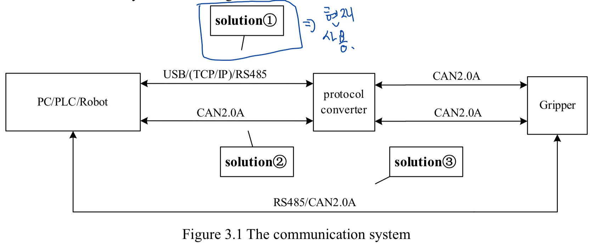
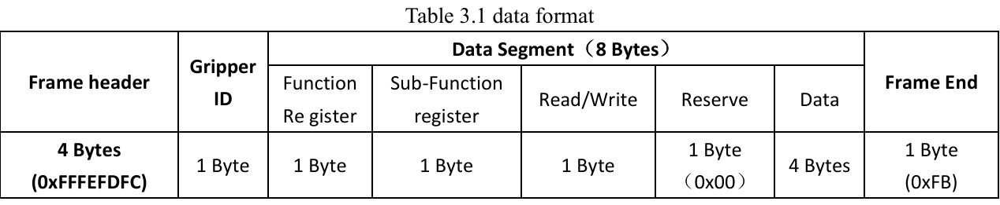

# 커맨드 정리본

이 파일은 커맨드 관련을 정리한 요약문입니다. 

## 1. 통신 시스템



## 2. 전송 기본 방법 

| 필드           | 길이   | 설명                            |
| ------------ | ---- | ----------------------------- |
| Frame Header | 4바이트 | 항상 `FF FE FD FC`              |
| Gripper ID   | 1바이트 | 기본값: `0x01`                   |
| Data Segment | 8바이트 | CAN 포맷과 동일 (Function \~ Data) |
| Frame End    | 1바이트 | 항상 `0xFB`                     |

---------------------------------------------------

### 2.1. 예시 
```
FF FE FD FC 01 08 02 01 00 00 00 00 00 FB
```
| 바이트           | 의미                      |
| ------------- | ----------------------- |
| `FFFEFDFC`    | 프레임 시작 (Header)         |
| `01`          | 그리퍼 ID (기본값 1)          |
| `08`          | Function Register = 초기화 |
| `02`          | Sub-function = 동작 실행    |
| `01`          | 쓰기(write) 명령            |
| `00`          | 예약 (항상 0)               |
| `00 00 00 00` | 데이터 (없음, 초기화 실행)        |
| `FB`          | 프레임 종료                  |

---------------------------------------------------
## 3. 주요 함수 통합 리뷰

각 주요 기능에 대한 기능 설명, Function/Sub-function 레지스터 값, 그리고 실제 전송할 14바이트 명령 예시를 한눈에 정리한 표입니다.  
기본 Gripper ID는 `0x01` 기준입니다.

| 기능 | Function Reg | Sub-function | 설명 | 전송 명령 예시 (Hex) |
|------|---------------|---------------|------|------------------------|
| 초기화 (Init) | `0x08` | `0x02` | 그리퍼를 초기화하여 동작 준비 상태로 만듭니다. | `FF FE FD FC 01 08 02 01 00 00 00 00 00 FB` |
| 파지 힘 설정 (Force = 60%) | `0x05` | `0x02` | 그리퍼 파지 힘을 60%로 설정합니다. | `FF FE FD FC 01 05 02 01 00 3C 00 00 00 FB` |
| 위치 설정 (Position = 80%) | `0x06` | `0x02` | 그리퍼를 80%만큼 닫도록 이동시킵니다. | `FF FE FD FC 01 06 02 01 00 50 00 00 00 FB` |
| 상태 확인 (Status) | `0x0F` | `0x01` | 그리퍼의 현재 상태(움직이는 중, 파지 성공 여부 등)를 읽습니다. | `FF FE FD FC 01 0F 01 00 00 00 00 00 00 FB` |
| 피드백 설정 (ON) | `0x08` | `0x01` | 초기화 완료 후 피드백을 받도록 설정합니다. | `FF FE FD FC 01 08 01 01 00 A5 00 00 00 FB` |
| 피드백 설정 (OFF) | `0x08` | `0x01` | 피드백을 비활성화합니다. | `FF FE FD FC 01 08 01 01 00 00 00 00 00 FB` |
| I/O 모드 설정 (ON) | `0x10` | `0x09` | 디지털 I/O 제어 모드를 활성화합니다. | `FF FE FD FC 01 10 09 01 00 01 00 00 00 FB` |
| I/O 모드 설정 (OFF) | `0x10` | `0x09` | 디지털 I/O 제어 모드를 비활성화합니다. | `FF FE FD FC 01 10 09 01 00 00 00 00 00 FB` |


## 5. 함수 메뉴얼

### 5.1. 초기화 
초기화는 크게 초가화 설정과 초기화 진행으로 나누어져 있습니다. 초기화 설정(`0x01`)은 피드백을 받을지 말지에 대해서 설정을 하고 이를 확인하는 함수입니다. 실제로는 작동하지 않습니다. 

하지만 초기화 진행(`0x02`)에서는 위에서 설정한 값들로 실제 초기화를 진행합니다. 
| Sub-function | 기능               | 목적                                        | Read/Write                     | 사용하는 값                                        | 예시                                |
| ------------ | ---------------- | ----------------------------------------- | ------------------------------ | --------------------------------------------- | --------------------------------- |
| `0x01`       | **피드백 설정**       | 초기화 후 피드백(응답)을 **받을지 설정** 또는 **설정 여부 확인** | Read (`0x00`) / Write (`0x01`) | `0xA5` (ON), `0x00` (OFF)                     | "초기화가 끝났을 때 응답을 줄까?"를 설정          |
| `0x02`       | **초기화 실행/상태 확인** | 실제로 그리퍼를 **초기화 실행**하거나 **완료 여부 확인**       | Read (`0x00`) / Write (`0x01`) | `0x00` (기본값), 응답값 `0x01` (완료) or `0x00` (미완료) | "초기화를 실제로 실행할까?" 혹은 "지금 초기화 끝났니?" |
